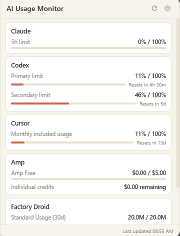
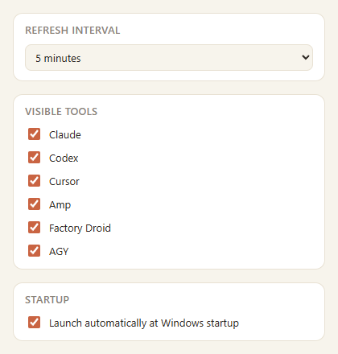

# AI 用量监控

<p align="center">
  
</p>
<p align="center">
  <b>一个常驻系统托盘的小工具，帮你随时盯紧各家 AI 编程工具还剩多少额度。</b>
</p>
<p align="center">
  
  
</p>

Windows 系统托盘小工具，实时展示本机已安装的 AI 编程工具的用量/配额：**Claude Code**、**Codex CLI**、**Cursor**、**Amp**、**Factory Droid**、**AGY**。

托盘图标常驻，点击弹出小窗，各工具的用量、限额、重置倒计时一目了然；某个工具取数失败或未登录，不影响其他工具正常显示。

## 界面预览

| 托盘弹窗 | 设置窗口 |
|---|---|
|  |  |

## 功能

- 托盘弹窗展示各工具当前用量、限额百分比、重置倒计时
- 设置窗口可选择要监控哪些工具、刷新间隔、是否开机自启
- 后台按设定间隔自动轮询，也可手动立即刷新
- 各工具适配器相互隔离，单个工具取数失败不影响其他工具

## 下载

不想自己编译的话，直接去 [Releases](../../releases) 页面下载最新的 `tauri-app.exe`，双击即可运行（免安装，绿色单文件）。

## 技术栈

Tauri v2（Rust）+ React 19 + TypeScript + Vite

## 开发

```bash
npm install
npm run tauri dev
```

## 构建

只想拿到一个可执行文件（不生成安装包）：

```bash
npm run tauri build -- --no-bundle
```

产物在 `src-tauri/target/release/tauri-app.exe`，双击即可运行。

如果需要生成安装包（`.msi` / NSIS `.exe`，安装后才会正常注册到系统、支持开机自启）：

```bash
npm run tauri build
```

产物在 `src-tauri/target/release/bundle/` 下。

推荐 IDE：VS Code + [Tauri](https://marketplace.visualstudio.com/items?itemName=tauri-apps.tauri-vscode) + [rust-analyzer](https://marketplace.visualstudio.com/items?itemName=rust-lang.rust-analyzer)

## 支持的工具及数据来源

| 工具 | 数据来源 |
|---|---|
| Claude Code | `~/.claude/.credentials.json`（OAuth）+ Anthropic usage API |
| Codex CLI | `~/.codex/auth.json` |
| Cursor | 本地 SQLite（`globalStorage/state.vscdb`）+ Cursor dashboard usage API |
| Amp | `amp` CLI 输出解析 |
| Factory Droid | `~/.factory/auth.v2.*` 或 `~/.factory/auth.encrypted` |
| AGY | `%LOCALAPPDATA%/agy/bin/agy.exe` + `~/.gemini/oauth_creds.json` + Google Code Assist quota API |

## 已知限制

目前仅在 Windows 上开发和验证；`amp` 二进制探测与 Claude 凭据读取在 macOS 上存在已知的兼容性缺口（详见 `CLAUDE.md`）。

## 贡献

欢迎提 Issue / PR，尤其是新增工具适配器（在 `src-tauri/src/adapters/` 下新增一个文件，实现同样的 `fetch()` 约定即可）或补充截图。
